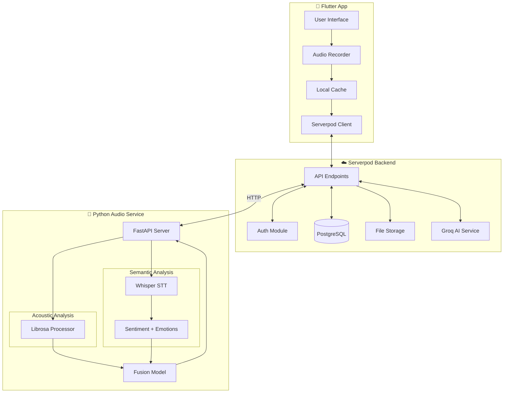
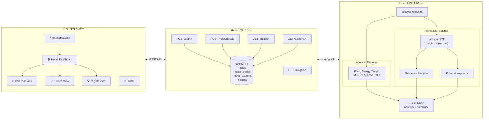
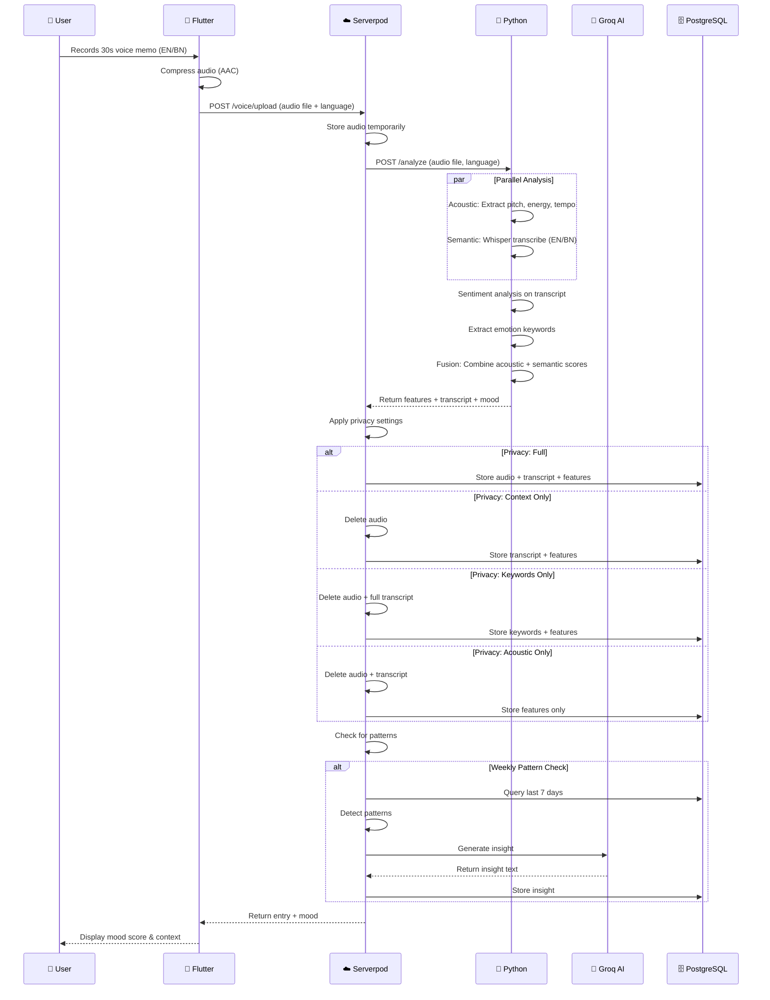
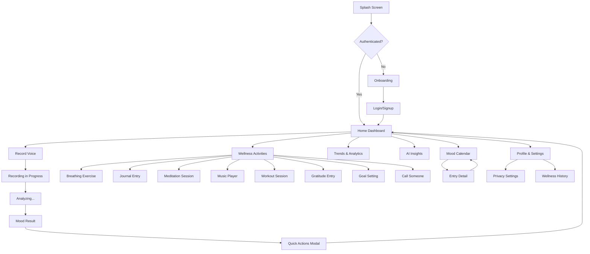
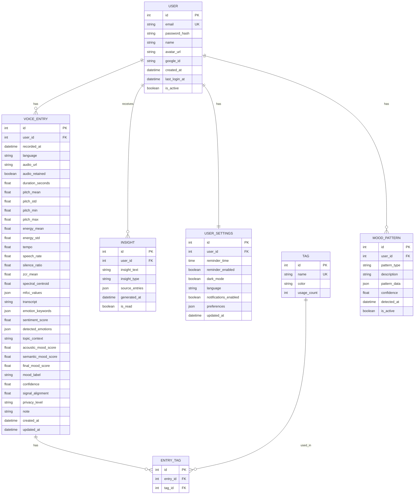
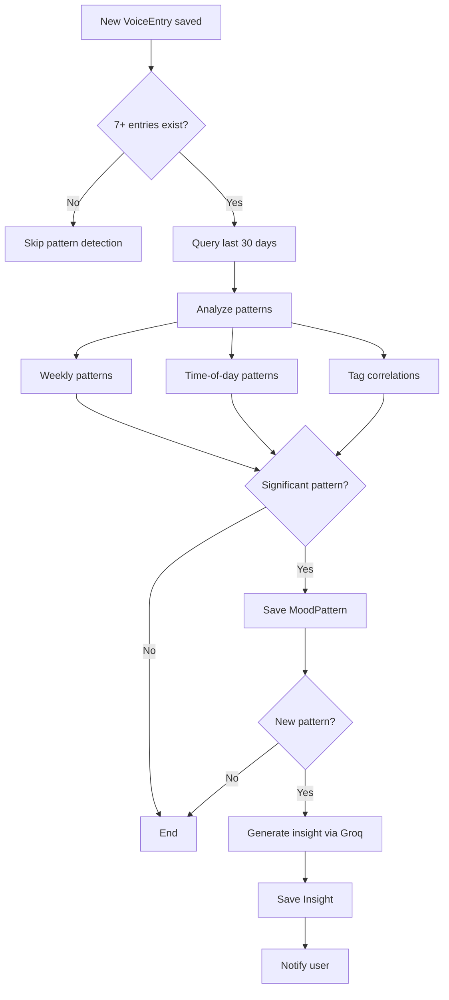

# 🎙️ Resonate

> **"Your voice speaks louder than words"**

Resonate is a personal emotional wellness butler that uses **multi-modal analysis** - combining *how* you speak (acoustic patterns) with *what* you say (semantic context) - to track your mood with high accuracy. Supports **English** and **Bengali**. Built with Flutter, Serverpod, and Python for the **Flutter Butler Hackathon**.

---

## 📋 Table of Contents

- [Overview](#overview)
- [Key Features](#key-features)
- [Architecture](#architecture)
- [Tech Stack](#tech-stack)
- [Frontend Implementation Status](#frontend-implementation-status)
- [Frontend Screens](#frontend-screens)
- [API Endpoints](#api-endpoints)
- [Database Schema](#database-schema)
- [Data Flow](#data-flow)
- [Voice Features Analyzed](#voice-features-analyzed)
- [Getting Started](#getting-started)
- [Project Structure](#project-structure)
- [Deployment](#deployment)
- [Future Enhancements](#future-enhancements)

---

## 🌟 Overview

### The Problem
Mental health tracking is hard. Journaling feels like a chore. Mood apps require manual input. Most people don't realize their emotional patterns until it's too late.

### The Solution
**Resonate** uses a hybrid approach: record a 30-second voice memo each day, and the app analyzes both your voice acoustics (pitch, energy, tempo) AND the semantic content (what you're talking about) to derive your emotional state with ~90% accuracy. Over time, it reveals patterns you never knew existed.

### Why It's Different
- **Multi-modal analysis** - Combines acoustic signals + semantic context for higher accuracy
- **Bilingual support** - Full support for English and Bengali (বাংলা)
- **Context-aware** - Understands that "I miss my grandmother" means sadness, not just low energy
- **Privacy controls** - You choose what's stored: full audio, transcript only, keywords only, or acoustic features only
- **No manual input** - Just talk naturally
- **AI as enhancement** - Core analysis is signal processing + NLP; AI provides insights
- **100% Free Stack** - All tools and APIs used are free or have generous free tiers

### 💰 Cost: $0 (Student-Friendly)

| Component | Tool | Why Free |
|-----------|------|----------|
| Speech-to-Text | OpenAI Whisper | Runs locally, open-source |
| Audio Analysis | Librosa | Open-source Python library |
| Sentiment | TextBlob/NLTK | Open-source Python libraries |
| AI Insights | Groq API | 14,400 free requests/day |
| Backend | Serverpod | Open-source framework |
| Database | PostgreSQL | Open-source, runs in Docker |
| Hosting | Serverpod Cloud | Free hackathon credits provided |

---

## ✨ Key Features

### Core Features (MVP)

| Feature | Description |
|---------|-------------|
| 🎙️ **Daily Voice Check-in** | Record a voice memo (5-60 seconds) about your day |
| 🔊 **Acoustic Analysis** | Analyze pitch, energy, tempo, pauses from your voice |
| 📝 **Semantic Analysis** | Transcribe and understand context (emotion keywords, sentiment) |
| 📊 **Fusion Mood Score** | Combined score from both acoustic + semantic signals |
| 📅 **Mood Calendar** | Visual heatmap of your emotional journey over time |
| 📈 **Trend Charts** | Weekly/monthly mood trend visualization with fl_chart |
| 🔍 **Pattern Detection** | Automatic detection of emotional patterns |
| 💡 **AI Insights** | Groq-powered observations and personalized suggestions |
| 🔐 **Privacy Controls** | Choose what data is stored (audio, transcript, keywords, or features only) |

### Wellness Features (Implemented)

| Feature | Description |
|---------|-------------|
| 🌬️ **Breathing Exercises** | Guided 4-7-8 breathing technique with visual animation |
| 📓 **Quick Journal** | Mood-based journal prompts with save functionality |
| 🧘 **Guided Meditation** | Multiple types: Quick Reset, Body Scan, Loving Kindness, Sleep |
| 🎵 **Mood-based Music** | Curated playlists: Calm, Uplifting, Focus, Energizing with player |
| 📞 **Call Someone** | Quick access to supportive contacts when needed |
| 💪 **Workout Sessions** | Guided workouts: Stretching, Dance, HIIT, Walking |
| 🙏 **Gratitude Practice** | Daily gratitude journaling with prompts |
| 🎯 **Goal Setting** | Set and track wellness goals |

### Enhanced Features

| Feature | Description |
|---------|-------------|
| 🌍 **Bilingual Voice Support** | Speak in English or Bengali - both fully supported |
| 🏷️ **Auto-detected Topics** | Automatic context detection (work, family, health, etc.) |
| 🏷️ **Context Tags** | Manually tag entries with custom context |
| 😢 **Emotion Detection** | Detailed emotion analysis with visual breakdown |
| 🔔 **Smart Reminders** | Personalized reminder based on your optimal check-in time |
| 📤 **Export Data** | Export your mood data for personal records |
| 🌙 **Dark Mode** | Eye-friendly dark theme throughout the app |
| 🌐 **Multi-language UI** | Interface in English and Bengali (বাংলা) |
| ✨ **Personalized Responses** | AI-generated affirmations and suggestions based on mood |
| 🎯 **Quick Actions** | Post-save suggestions for wellness activities |

---

## 📱 Frontend Implementation Status

### ✅ Completed (Flutter App)

| Screen/Feature | Status | Description |
|----------------|--------|-------------|
| Splash Screen | ✅ Done | Animated logo with auth state check |
| Onboarding (3 slides) | ✅ Done | Introduction to app features |
| Login/Signup | ✅ Done | Email/password authentication UI |
| Home Dashboard | ✅ Done | Today's mood, stats, quick actions grid |
| Voice Recording | ✅ Done | Waveform visualization, 5-60s recording |
| Analysis Animation | ✅ Done | Step-by-step analysis progress |
| Result Screen | ✅ Done | Mood display, emotions, tags, save entry |
| Mood Calendar | ✅ Done | Monthly view with color-coded entries |
| Entry Detail | ✅ Done | Full entry view with all data |
| Trends & Analytics | ✅ Done | Charts with fl_chart, pattern display |
| AI Insights | ✅ Done | Insight cards with personalized tips |
| Profile & Settings | ✅ Done | User stats, preferences, export |
| Privacy Settings | ✅ Done | 4-level privacy control UI |
| Dark Mode | ✅ Done | Full dark theme support |
| Wellness History | ✅ Done | Journal, gratitude, goals history |

### ✅ Wellness Features (Fully Implemented)

| Feature | Screen | Functionality |
|---------|--------|---------------|
| 🌬️ Breathing | Modal | 4-7-8 breathing with animated circle |
| 📓 Journal | Modal | Mood-based prompts, save to history |
| 🧘 Meditation | Full Screen | 4 types, timer, guided phases, pause/resume |
| 🎵 Music Player | Full Screen | Categories, playlist, play/pause, volume, visualizer, "Up Next" sidebar |
| 📞 Call Someone | Modal | Contact grid, quick-dial simulation |
| 💪 Workout | Full Screen | 4 types, exercise timer, rest periods, instructions |
| 🙏 Gratitude | Modal | 3-item gratitude entry, save to history |
| 🎯 Goals | Modal | Preset goals, custom goals, save to history |

### 🔧 Backend Integration (Pending)

The frontend currently uses **simulated data** for demonstration. Backend integration needed for:

| Feature | Backend Required |
|---------|-----------------|
| User Authentication | Serverpod Auth |
| Voice Upload & Storage | Serverpod + File Storage |
| Audio Analysis | Python FastAPI (Librosa + Whisper) |
| Entry Persistence | PostgreSQL via Serverpod |
| Pattern Detection | Serverpod scheduled jobs |
| AI Insights | Groq API via Serverpod |
| Push Notifications | Serverpod + FCM |

---

## 🏗️ Architecture

### High-Level Architecture



### Detailed Component Architecture



### Request Flow Diagram



---

## 🛠️ Tech Stack

| Layer | Technology | Purpose | Cost |
|-------|------------|---------|------|
| **Frontend** | Flutter 3.x | Cross-platform mobile app | Free ✅ |
| **State Management** | Riverpod | Reactive state management | Free ✅ |
| **Backend** | Serverpod 2.x | Dart-based backend framework | Free ✅ |
| **Database** | PostgreSQL | Primary data storage | Free ✅ |
| **Acoustic Analysis** | Python + Librosa | Voice feature extraction | Free ✅ |
| **Speech-to-Text** | OpenAI Whisper (local) | Transcription (EN + BN) | Free ✅ |
| **Sentiment Analysis** | TextBlob / NLTK | Emotion detection | Free ✅ |
| **API Framework** | FastAPI | Python REST API | Free ✅ |
| **AI/Insights** | Groq API (Llama 3) | Pattern interpretation | Free tier ✅ |
| **Auth** | Serverpod Auth | Email + Google sign-in | Free ✅ |
| **File Storage** | Serverpod Cloud | Audio file storage | Hackathon credits ✅ |

---

## 📱 Frontend Screens

### Screen Map



---

## 🔌 API Endpoints

### Serverpod Endpoints

#### Authentication

| Method | Endpoint | Description | Request | Response |
|--------|----------|-------------|---------|----------|
| POST | `/auth/register` | Create new account | `{email, password, name}` | `{user, token}` |
| POST | `/auth/login` | Login with email | `{email, password}` | `{user, token}` |
| POST | `/auth/google` | Google OAuth login | `{idToken}` | `{user, token}` |
| POST | `/auth/logout` | Logout user | `{token}` | `{success}` |
| GET | `/auth/me` | Get current user | - | `{user}` |

#### Voice Entries

| Method | Endpoint | Description | Request | Response |
|--------|----------|-------------|---------|----------|
| POST | `/voice/upload` | Upload voice recording | `multipart: {audio, language: 'en'\|'bn', note?, tags?}` | `{voiceEntry}` |
| GET | `/voice/entries` | Get user's entries | `?from=date&to=date&limit=20` | `{entries[]}` |
| GET | `/voice/entry/{id}` | Get single entry | - | `{voiceEntry}` |
| DELETE | `/voice/entry/{id}` | Delete entry | - | `{success}` |
| PUT | `/voice/entry/{id}` | Update note/tags | `{note?, tags?}` | `{voiceEntry}` |

#### Analytics & Patterns

| Method | Endpoint | Description | Request | Response |
|--------|----------|-------------|---------|----------|
| GET | `/analytics/summary` | Get mood summary | `?period=week\|month\|year` | `{summary}` |
| GET | `/analytics/trends` | Get trend data | `?from=date&to=date` | `{trendData[]}` |
| GET | `/analytics/calendar` | Get calendar data | `?month=1&year=2026` | `{calendarData[]}` |
| GET | `/patterns` | Get detected patterns | - | `{patterns[]}` |

#### Insights

| Method | Endpoint | Description | Request | Response |
|--------|----------|-------------|---------|----------|
| GET | `/insights` | Get all insights | `?limit=10` | `{insights[]}` |
| GET | `/insights/latest` | Get latest insight | - | `{insight}` |
| POST | `/insights/generate` | Force generate insight | - | `{insight}` |

#### User Settings

| Method | Endpoint | Description | Request | Response |
|--------|----------|-------------|---------|----------|
| GET | `/settings` | Get user settings | - | `{settings}` |
| PUT | `/settings` | Update settings | `{reminderTime?, darkMode?}` | `{settings}` |
| GET | `/settings/export` | Export all user data | - | `{downloadUrl}` |

### Python Audio Service Endpoints

| Method | Endpoint | Description | Request | Response |
|--------|----------|-------------|---------|----------|
| POST | `/analyze` | Full analysis (acoustic + semantic) | `multipart: {audio, language: 'en'\|'bn'}` | `{acoustic, semantic, fusion}` |
| POST | `/analyze/acoustic` | Acoustic analysis only | `multipart: {audio}` | `{features, acousticScore}` |
| POST | `/transcribe` | Transcribe audio only | `multipart: {audio, language}` | `{transcript, language}` |
| GET | `/health` | Health check | - | `{status: "ok"}` |
| GET | `/languages` | Supported languages | - | `{languages: ["en", "bn"]}` |

#### Python `/analyze` Response Schema (Full Hybrid Analysis)

```json
{
  "acoustic": {
    "features": {
      "pitch_mean": 142.5,
      "pitch_std": 23.4,
      "pitch_min": 98.2,
      "pitch_max": 189.7,
      "energy_mean": 0.073,
      "energy_std": 0.021,
      "tempo": 4.2,
      "speech_rate": 3.8,
      "silence_ratio": 0.15,
      "zcr_mean": 0.045,
      "spectral_centroid": 1834.5,
      "mfcc": [12.3, -23.4, 5.6, "..."]
    },
    "mood_score": 0.68,
    "mood_label": "positive"
  },
  "semantic": {
    "transcript": "I had a really good meeting today, feeling hopeful about the project",
    "language_detected": "en",
    "sentiment": {
      "score": 0.75,
      "label": "positive"
    },
    "emotions": ["hopeful", "excited", "confident"],
    "keywords": ["good", "hopeful", "meeting"],
    "topic": "work"
  },
  "fusion": {
    "final_mood_score": 0.72,
    "mood_label": "positive",
    "confidence": 0.92,
    "signal_alignment": 0.85,
    "acoustic_weight": 0.4,
    "semantic_weight": 0.6
  },
  "analysis_duration_ms": 1234
}
```

---

## 🗄️ Database Schema

### Entity Relationship Diagram



### Table Definitions

#### users
```sql
CREATE TABLE users (
    id SERIAL PRIMARY KEY,
    email VARCHAR(255) UNIQUE NOT NULL,
    password_hash VARCHAR(255),
    name VARCHAR(100) NOT NULL,
    avatar_url TEXT,
    google_id VARCHAR(255),
    created_at TIMESTAMP DEFAULT CURRENT_TIMESTAMP,
    last_login_at TIMESTAMP,
    is_active BOOLEAN DEFAULT TRUE
);
```

#### voice_entries
```sql
CREATE TABLE voice_entries (
    id SERIAL PRIMARY KEY,
    user_id INTEGER REFERENCES users(id) ON DELETE CASCADE,
    recorded_at TIMESTAMP NOT NULL,
    language VARCHAR(10) NOT NULL DEFAULT 'en', -- 'en' or 'bn'
    audio_url TEXT,
    audio_retained BOOLEAN DEFAULT TRUE,
    duration_seconds FLOAT NOT NULL,
    
    -- Acoustic Features
    pitch_mean FLOAT,
    pitch_std FLOAT,
    pitch_min FLOAT,
    pitch_max FLOAT,
    energy_mean FLOAT,
    energy_std FLOAT,
    tempo FLOAT,
    speech_rate FLOAT,
    silence_ratio FLOAT,
    zcr_mean FLOAT,
    spectral_centroid FLOAT,
    mfcc_values JSONB,
    
    -- Semantic Features
    transcript TEXT,                    -- Full transcript (if privacy allows)
    emotion_keywords JSONB,             -- ["happy", "excited", "hopeful"]
    sentiment_score FLOAT,              -- -1 to 1
    detected_emotions JSONB,            -- ["joy", "hope"]
    topic_context VARCHAR(50),          -- "work", "family", "health"
    
    -- Mood Scores (Hybrid)
    acoustic_mood_score FLOAT,          -- From voice only
    semantic_mood_score FLOAT,          -- From words only
    final_mood_score FLOAT NOT NULL,    -- Combined
    mood_label VARCHAR(50) NOT NULL,
    confidence FLOAT,
    signal_alignment FLOAT,             -- Do voice and words agree? (0-1)
    
    -- Privacy & User Input
    privacy_level VARCHAR(20) DEFAULT 'full', -- 'full', 'context', 'keywords', 'acoustic'
    note TEXT,
    
    created_at TIMESTAMP DEFAULT CURRENT_TIMESTAMP,
    updated_at TIMESTAMP DEFAULT CURRENT_TIMESTAMP
);

CREATE INDEX idx_voice_entries_user_date ON voice_entries(user_id, recorded_at DESC);
```

#### tags
```sql
CREATE TABLE tags (
    id SERIAL PRIMARY KEY,
    name VARCHAR(50) UNIQUE NOT NULL,
    color VARCHAR(7) DEFAULT '#6366F1',
    usage_count INTEGER DEFAULT 0
);

-- Default tags
INSERT INTO tags (name, color) VALUES
    ('Work', '#EF4444'),
    ('Family', '#F59E0B'),
    ('Exercise', '#10B981'),
    ('Social', '#3B82F6'),
    ('Health', '#EC4899'),
    ('Travel', '#8B5CF6');
```

#### entry_tags
```sql
CREATE TABLE entry_tags (
    id SERIAL PRIMARY KEY,
    entry_id INTEGER REFERENCES voice_entries(id) ON DELETE CASCADE,
    tag_id INTEGER REFERENCES tags(id) ON DELETE CASCADE,
    UNIQUE(entry_id, tag_id)
);
```

#### mood_patterns
```sql
CREATE TABLE mood_patterns (
    id SERIAL PRIMARY KEY,
    user_id INTEGER REFERENCES users(id) ON DELETE CASCADE,
    pattern_type VARCHAR(50) NOT NULL, -- 'weekly', 'time_of_day', 'tag_correlation'
    description TEXT NOT NULL,
    pattern_data JSONB NOT NULL,
    confidence FLOAT,
    detected_at TIMESTAMP DEFAULT CURRENT_TIMESTAMP,
    is_active BOOLEAN DEFAULT TRUE
);

-- Example pattern_data:
-- {
--   "type": "weekly",
--   "peak_days": ["tuesday", "thursday"],
--   "low_days": ["monday"],
--   "avg_by_day": {"monday": 0.45, "tuesday": 0.78, ...}
-- }
```

#### insights
```sql
CREATE TABLE insights (
    id SERIAL PRIMARY KEY,
    user_id INTEGER REFERENCES users(id) ON DELETE CASCADE,
    insight_text TEXT NOT NULL,
    insight_type VARCHAR(50), -- 'weekly_summary', 'pattern_alert', 'tip'
    source_entries JSONB, -- Array of entry IDs used to generate
    generated_at TIMESTAMP DEFAULT CURRENT_TIMESTAMP,
    is_read BOOLEAN DEFAULT FALSE
);
```

#### user_settings
```sql
CREATE TABLE user_settings (
    id SERIAL PRIMARY KEY,
    user_id INTEGER REFERENCES users(id) ON DELETE CASCADE UNIQUE,
    reminder_time TIME DEFAULT '09:00:00',
    reminder_enabled BOOLEAN DEFAULT TRUE,
    dark_mode BOOLEAN DEFAULT FALSE,
    ui_language VARCHAR(10) DEFAULT 'en',           -- UI language
    voice_language VARCHAR(10) DEFAULT 'en',        -- Default voice recording language
    privacy_level VARCHAR(20) DEFAULT 'full',       -- 'full', 'context', 'keywords', 'acoustic'
    notifications_enabled BOOLEAN DEFAULT TRUE,
    preferences JSONB DEFAULT '{}',
    updated_at TIMESTAMP DEFAULT CURRENT_TIMESTAMP
);

-- Privacy level options:
-- 'full'     - Store audio + transcript + features (best accuracy ~90%)
-- 'context'  - Store transcript + features, delete audio (~85% accuracy)
-- 'keywords' - Store emotion keywords + features only (~80% accuracy)
-- 'acoustic' - Store features only, no text (~70% accuracy)
```

---

## 🔄 Data Flow

### Voice Check-in Flow

```mermaid
flowchart LR
    subgraph Step1["1️⃣ Record"]
        A[User taps Record] --> B[30s voice memo]
    end
    
    subgraph Step2["2️⃣ Upload"]
        B --> C[Compress to AAC]
        C --> D[Upload to Serverpod]
    end
    
    subgraph Step3["3️⃣ Analyze"]
        D --> E[Serverpod stores audio]
        E --> F[Calls Python service]
        F --> G[Librosa extracts features]
        G --> H[Calculate mood score]
    end
    
    subgraph Step4["4️⃣ Store"]
        H --> I[Return features to Serverpod]
        I --> J[Save VoiceEntry to DB]
    end
    
    subgraph Step5["5️⃣ Display"]
        J --> K[Return to Flutter]
        K --> L[Show mood result]
    end
```



### Pattern Detection Flow



### Insight Generation Flow


---

## 🎙️ Voice Features Analyzed

### Acoustic Features (How You Speak)

| Feature | What It Measures | Emotional Correlation |
|---------|------------------|----------------------|
| **Pitch Mean (F0)** | Average voice frequency | Higher = excited/anxious, Lower = sad/tired |
| **Pitch Std** | Pitch variation | Higher = animated, Lower = monotone/depressed |
| **Energy Mean (RMS)** | Average loudness | Higher = confident/energetic, Lower = withdrawn |
| **Energy Std** | Loudness variation | Higher = expressive, Lower = flat affect |
| **Tempo** | Speaking speed | Faster = excited/anxious, Slower = calm/tired |
| **Silence Ratio** | Pauses vs speech | Higher = hesitant/thoughtful, Lower = rushed |

### Secondary Acoustic Features

| Feature | What It Measures | Use Case |
|---------|------------------|----------|
| **MFCCs** | Voice texture/timbre | Unique voice fingerprint, subtle changes |
| **Spectral Centroid** | Brightness of voice | Correlates with alertness |
| **Zero Crossing Rate** | Voice vs noise | Speech quality indicator |
| **Jitter** | Pitch instability | Stress/anxiety indicator |
| **Shimmer** | Amplitude instability | Fatigue indicator |

### Semantic Features (What You Say)

| Feature | What It Measures | Example |
|---------|------------------|---------|
| **Transcript** | Full text of speech | "I had a great day at work today" |
| **Sentiment Score** | Overall positivity/negativity (-1 to 1) | +0.75 (positive) |
| **Emotion Keywords** | Specific emotion-laden words | ["great", "happy", "excited"] |
| **Detected Emotions** | Categorized emotions | ["joy", "contentment"] |
| **Topic Context** | What the speech is about | "work", "family", "health" |

### Emotion Keywords Dictionary (English + Bengali)

```python
EMOTION_KEYWORDS = {
    "joy": {
        "en": ["happy", "excited", "amazing", "love", "great", "wonderful", "fantastic"],
        "bn": ["খুশি", "আনন্দ", "ভালো", "সুন্দর", "অসাধারণ", "মজা"]
    },
    "sadness": {
        "en": ["sad", "miss", "lost", "crying", "hurt", "lonely", "depressed"],
        "bn": ["দুঃখ", "কষ্ট", "মন খারাপ", "একা", "কান্না", "হারানো"]
    },
    "anger": {
        "en": ["angry", "frustrated", "annoyed", "hate", "furious", "irritated"],
        "bn": ["রাগ", "বিরক্ত", "ক্ষুব্ধ", "ঘৃণা"]
    },
    "anxiety": {
        "en": ["worried", "stressed", "nervous", "scared", "anxious", "tense"],
        "bn": ["চিন্তা", "ভয়", "উদ্বেগ", "টেনশন", "নার্ভাস"]
    },
    "calm": {
        "en": ["peaceful", "relaxed", "calm", "content", "serene", "balanced"],
        "bn": ["শান্ত", "স্বস্তি", "আরাম", "তৃপ্ত"]
    }
}
```

### Hybrid Mood Score Calculation

```python
def calculate_hybrid_mood_score(acoustic_features: dict, semantic_analysis: dict) -> dict:
    """
    Combines acoustic (HOW you speak) and semantic (WHAT you say) signals
    for more accurate mood detection.
    
    Returns mood score from 0 (very low) to 1 (very positive)
    """
    
    # 1. Calculate acoustic mood score
    energy_norm = normalize(acoustic_features['energy_mean'], 0.01, 0.15)
    pitch_var_norm = normalize(acoustic_features['pitch_std'], 5, 50)
    tempo_norm = normalize(acoustic_features['tempo'], 60, 180)
    silence_norm = 1 - normalize(acoustic_features['silence_ratio'], 0, 0.4)
    
    acoustic_score = (
        energy_norm * 0.35 +
        pitch_var_norm * 0.30 +
        tempo_norm * 0.20 +
        silence_norm * 0.15
    )
    
    # 2. Get semantic mood score (from sentiment analysis)
    # Sentiment is -1 to 1, normalize to 0-1
    semantic_score = (semantic_analysis['sentiment_score'] + 1) / 2
    
    # 3. Boost/penalize based on emotion keywords
    emotion_boost = calculate_emotion_boost(semantic_analysis['emotions'])
    semantic_score = clamp(semantic_score + emotion_boost, 0, 1)
    
    # 4. Check signal alignment (do voice and words agree?)
    alignment = 1 - abs(acoustic_score - semantic_score)
    
    # 5. Fusion: Combine both signals
    if alignment > 0.7:
        # Signals agree - high confidence, equal weight
        final_score = (acoustic_score * 0.4 + semantic_score * 0.6)
        confidence = 0.9 + (alignment - 0.7) * 0.33  # 0.9 to 1.0
    else:
        # Signals disagree - might be sarcasm, mixed emotions
        # Weight semantic higher (words usually reveal truth)
        final_score = (acoustic_score * 0.3 + semantic_score * 0.7)
        confidence = 0.5 + alignment * 0.4  # 0.5 to 0.78
    
    return {
        "acoustic_score": acoustic_score,
        "semantic_score": semantic_score,
        "final_score": clamp(final_score, 0, 1),
        "confidence": confidence,
        "signal_alignment": alignment,
        "mood_label": get_mood_label(final_score)
    }

def get_mood_label(score: float) -> str:
    if score > 0.75: return "very_positive"
    if score > 0.55: return "positive"
    if score > 0.45: return "neutral"
    if score > 0.25: return "low"
    return "very_low"
```

---

## 🚀 Getting Started

### Prerequisites

- Flutter SDK 3.16+
- Dart SDK 3.2+
- Docker & Docker Compose
- Python 3.10+
- PostgreSQL 15+

### Installation

#### 1. Clone the Repository

```bash
git clone https://github.com/yourusername/resonate.git
cd resonate
```

#### 2. Set Up Python Audio Service

```bash
cd resonate_python

# Create virtual environment
python -m venv venv
source venv/bin/activate  # Windows: venv\Scripts\activate

# Install dependencies (includes Whisper for STT)
pip install -r requirements.txt

# Download Whisper model (first run only)
# This will download ~140MB for 'base' model
python -c "import whisper; whisper.load_model('base')"

# Run the service
uvicorn main:app --reload --port 8001
```

**Python Requirements (`requirements.txt`):**
```
fastapi==0.109.0
uvicorn==0.27.0
python-multipart==0.0.6
pydantic==2.5.0

# Audio Processing
librosa==0.10.1
numpy==1.26.0
scipy==1.12.0

# Speech-to-Text (English + Bengali)
openai-whisper==20231117

# Sentiment Analysis
textblob==0.17.1
nltk==3.8.1

# Optional: For better Bengali sentiment
# transformers==4.36.0
# torch==2.1.0
```

#### 3. Set Up Serverpod Backend

```bash
cd resonate_server

# Start PostgreSQL with Docker
docker-compose up -d

# Run database migrations
dart bin/main.dart --apply-migrations

# Start Serverpod
dart bin/main.dart
```

#### 4. Set Up Flutter App

```bash
cd resonate_flutter

# Get dependencies
flutter pub get

# Generate Serverpod client
cd ../resonate_client
serverpod generate

# Run the app
cd ../resonate_flutter
flutter run
```

### Environment Variables

#### Serverpod (`config/development.yaml`)
```yaml
apiServer:
  port: 8080
  publicHost: localhost
  publicPort: 8080

database:
  host: localhost
  port: 5432
  name: resonate
  user: postgres
  password: your_password

pythonService:
  baseUrl: http://localhost:8001

groq:
  apiKey: ${GROQ_API_KEY}
  model: llama-3.3-70b-versatile  # Free tier model
```

#### Python Service (`.env`)
```env
PORT=8001
DEBUG=true
MAX_AUDIO_DURATION=60
ALLOWED_FORMATS=wav,mp3,m4a,aac

# Whisper Settings (runs locally - FREE)
WHISPER_MODEL=base          # Options: tiny, base, small, medium, large
DEFAULT_LANGUAGE=en         # Default: en (English), bn (Bengali)

# Supported languages
SUPPORTED_LANGUAGES=en,bn   # English and Bengali

# Groq API (FREE tier - 14,400 requests/day)
GROQ_API_KEY=your_groq_api_key_here
GROQ_MODEL=llama-3.3-70b-versatile
```

### 🔑 Getting Free API Keys

#### Groq API (for AI Insights)
1. Go to [console.groq.com](https://console.groq.com)
2. Sign up with Google/GitHub (free)
3. Navigate to API Keys → Create new key
4. Copy the key to your `.env` file

**Free Tier Limits (Very Generous):**
- 14,400 requests/day
- 6,000 tokens/minute
- Models: Llama 3.3 70B, Mixtral 8x7B, Gemma 2 9B

---

## 📁 Project Structure

### Current Implementation (Flutter Frontend)

```
resonate/
│
├── resonate_flutter/                 # Flutter app (✅ IMPLEMENTED)
│   ├── lib/
│   │   ├── main.dart                 # App entry point with Riverpod
│   │   ├── core/
│   │   │   └── theme/
│   │   │       └── app_colors.dart   # Color system with mood colors
│   │   ├── data/
│   │   │   ├── models/
│   │   │   │   └── models.dart       # All data models
│   │   │   └── dummy_data.dart       # Mock data for demo
│   │   ├── navigation/
│   │   │   ├── app_router.dart       # GoRouter configuration
│   │   │   └── main_shell.dart       # Bottom navigation shell
│   │   ├── providers/
│   │   │   └── app_providers.dart    # Riverpod providers
│   │   ├── screens/
│   │   │   ├── splash/               # Splash screen
│   │   │   ├── onboarding/           # 3-slide onboarding
│   │   │   ├── auth/                 # Login & Signup
│   │   │   ├── home/                 # Dashboard + Quick Actions
│   │   │   ├── record/               # Recording + Result screens
│   │   │   ├── calendar/             # Mood calendar + Entry detail
│   │   │   ├── trends/               # Analytics with fl_chart
│   │   │   ├── insights/             # AI insights display
│   │   │   ├── profile/              # User profile
│   │   │   ├── settings/             # Privacy settings
│   │   │   └── wellness/             # Wellness activities
│   │   │       ├── music_player_screen.dart
│   │   │       ├── meditation_session_screen.dart
│   │   │       ├── workout_session_screen.dart
│   │   │       └── wellness_history_screen.dart
│   │   └── widgets/
│   │       └── shared_widgets.dart   # Reusable components
│   ├── assets/
│   │   └── images/                   # Logo and graphics
│   └── pubspec.yaml                  # Dependencies
│
├── resonate_server/                  # Serverpod backend (🔧 PLANNED)
│   ├── lib/
│   │   └── src/
│   │       ├── endpoints/
│   │       │   ├── auth_endpoint.dart
│   │       │   ├── voice_endpoint.dart
│   │       │   ├── analytics_endpoint.dart
│   │       │   ├── patterns_endpoint.dart
│   │       │   ├── insights_endpoint.dart
│   │       │   └── settings_endpoint.dart
│   │       ├── protocol/
│   │       │   ├── user.yaml
│   │       │   ├── voice_entry.yaml
│   │       │   ├── tag.yaml
│   │       │   ├── mood_pattern.yaml
│   │       │   ├── insight.yaml
│   │       │   └── user_settings.yaml
│   │       ├── services/
│   │       │   ├── python_client.dart
│   │       │   ├── groq_service.dart
│   │       │   ├── pattern_detector.dart
│   │       │   └── insight_generator.dart
│   │       └── jobs/
│   │           ├── weekly_insight_job.dart
│   │           └── pattern_detection_job.dart
│   ├── config/
│   ├── migrations/
│   └── pubspec.yaml
│
├── resonate_client/                  # Generated Serverpod client
│   └── lib/
│
├── resonate_python/                  # Python audio analysis service
│   ├── main.py                       # FastAPI app entry point
│   ├── acoustic_analyzer.py          # Librosa-based voice feature extraction
│   ├── semantic_analyzer.py          # Whisper STT + sentiment analysis
│   ├── fusion_model.py               # Combines acoustic + semantic scores
│   ├── emotion_keywords.py           # English + Bengali emotion dictionaries
│   ├── config.py                     # Configuration settings
│   ├── requirements.txt
│   ├── Dockerfile
│   └── tests/
│       ├── test_acoustic.py
│       ├── test_semantic.py
│       └── test_fusion.py
│
├── docker-compose.yml
├── README.md
└── .gitignore
```

---

## 🌐 Deployment

### Python Service (Render)

```yaml
# render.yaml
services:
  - type: web
    name: resonate-audio
    env: python
    buildCommand: pip install -r requirements.txt
    startCommand: uvicorn main:app --host 0.0.0.0 --port $PORT
    envVars:
      - key: PYTHON_VERSION
        value: 3.10.0
```

### Serverpod (Serverpod Cloud)

```bash
# Deploy to Serverpod Cloud
serverpod deploy
```

### Flutter App

- **Android**: Google Play Store
- **iOS**: Apple App Store
- **Web**: Serverpod Cloud hosting

---

## � Backend Implementation Plan

### Priority 1: Core Backend (Serverpod)

| Task | Endpoint | Description |
|------|----------|-------------|
| User Auth | `POST /auth/register`, `/login` | Email/password + Google OAuth |
| Voice Upload | `POST /voice/upload` | Accept audio file, call Python service |
| Entry CRUD | `GET/POST/DELETE /entries` | Store and retrieve voice entries |
| Settings | `GET/PUT /settings` | User preferences and privacy level |

### Priority 2: Python Audio Service (FastAPI)

| Task | Endpoint | Description |
|------|----------|-------------|
| Full Analysis | `POST /analyze` | Acoustic + Semantic fusion |
| Whisper STT | Internal | English + Bengali transcription |
| Librosa Features | Internal | Pitch, energy, tempo extraction |
| Sentiment | Internal | TextBlob/NLTK sentiment scoring |

### Priority 3: AI & Patterns

| Task | Service | Description |
|------|---------|-------------|
| Pattern Detection | Serverpod Job | Weekly pattern analysis |
| Insight Generation | Groq API | LLM-powered observations |
| Push Notifications | FCM | Reminders and insight alerts |

### Simplified Backend Approach

Given the hackathon timeline, consider using a simplified backend:

```
Option A: Full Serverpod Stack
├── Serverpod Server (Dart)
├── PostgreSQL Database
├── Python FastAPI (Audio Analysis)
└── Groq API (AI Insights)

Option B: Simplified Stack (Recommended for Hackathon)
├── Single Python FastAPI Server
│   ├── SQLite Database (portable)
│   ├── Librosa + Whisper (audio)
│   ├── Groq API (insights)
│   └── Simple JWT Auth
└── Direct Flutter ↔ Python communication
```

---

## 🔮 Future Enhancements

### Phase 1.5 (Backend Integration)
- [x] Complete Flutter frontend with all screens
- [x] Wellness activities (meditation, music, workout, journal)
- [x] Quick actions after saving entries
- [ ] Serverpod backend with PostgreSQL
- [ ] Python audio analysis service
- [ ] Real voice recording and analysis
- [ ] Groq AI insight generation

### Phase 2
- [ ] Apple Watch / Wear OS companion app
- [ ] Voice journaling with transcription (optional)
- [ ] Mood prediction based on patterns
- [ ] Integration with health apps (Apple Health, Google Fit)

### Phase 3
- [ ] Therapist dashboard (with user consent)
- [ ] Group/family mood tracking
- [ ] Smart home integration (adjust lights based on mood)
- [ ] Social sharing (anonymous mood trends)

### Phase 4
- [ ] Research mode for academic studies
- [ ] Enterprise wellness programs
- [ ] API for third-party integrations
- [ ] Voice biometric authentication

---

## 📦 Flutter Dependencies

```yaml
dependencies:
  flutter:
    sdk: flutter
  flutter_riverpod: ^2.4.9       # State management
  go_router: ^13.0.0             # Navigation
  flutter_screenutil: ^5.9.0     # Responsive sizing
  flutter_animate: ^4.3.0        # Animations
  fl_chart: ^0.65.0              # Charts and graphs
  # Future: serverpod_flutter, record, just_audio
```

---

## 📄 License

MIT License - See [LICENSE](LICENSE) for details.

---

## 🙏 Acknowledgments

- **Serverpod Team** - For the amazing Flutter Butler Hackathon
- **Librosa** - Audio feature extraction library
- **OpenAI Whisper** - Multilingual speech-to-text (English + Bengali)
- **Groq** - Fast & free LLM API for AI insights
- **TextBlob/NLTK** - Sentiment analysis
- **fl_chart** - Beautiful Flutter charts

---

## 📞 Contact

- **Developer**: Shawki
- **GitHub**: [yourusername](https://github.com/yourusername)

---

<p align="center">
  Built with ❤️ using Flutter + Serverpod for the Flutter Butler Hackathon 2026
</p>
